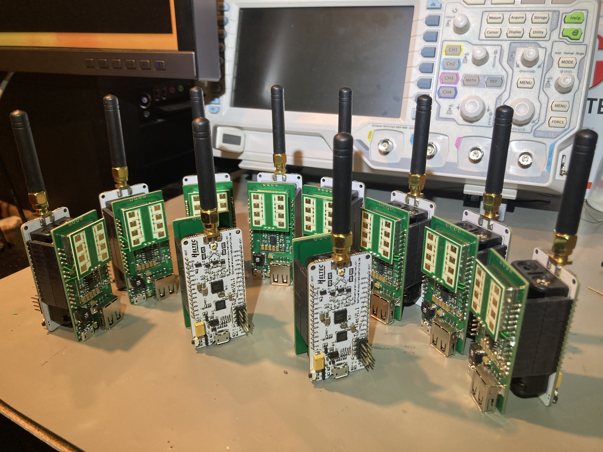

# smart_lights
This is a prototype for implementing smart lights: Lights that are saving
energy by selectively controlling which lights are on. The prototype is based
on the [Turtle Board from Radio Shuttle](https://www.radioshuttle.de/en/turtle-en/turtle-board-en/).
A radar motion detector has been added to the board, designed around the
cdm324 sensor, schematic and layout made in KiCAD and Inspired by
[limpkin](https://www.limpkin.fr/index.php?post/2017/02/22/Making-the-Electronics-for-a-24GHz-Doppler-Motion-Sensor).
The daughter board has one micro-usb connector for power and one usb-a connector
for a usb-lamp, which would be replaced with a zhaga socket on a real product.

The idea is this: Suppose luminaires are installed along a road and suppose
all luminaires are turned off. Now, if one luminaire detects motion, it will
lit itself up but also adjacent luminaires. Since adjacent luminaires are lit
up, the perceived feeling would be that the lights are on all the time.

The hardware for making this work looks like this:

